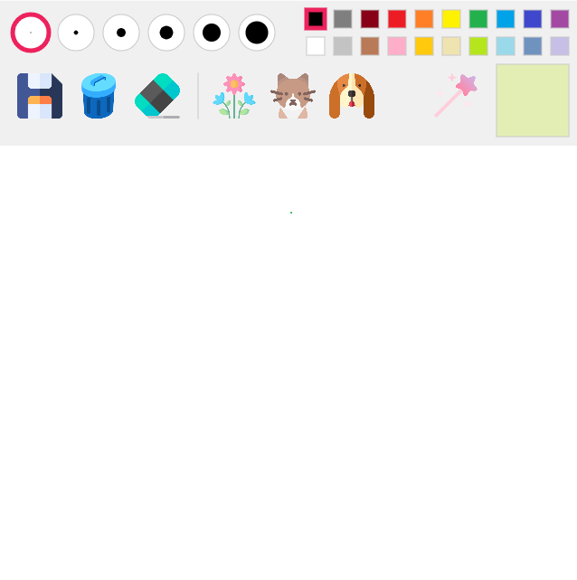
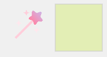
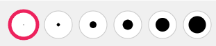
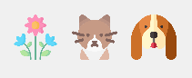

# p5js-Painting-Tool-Sketch-RNN

p5js로 작성한 그림판 프로그램입니다. 이미지를 클릭하면 실행 링크로 이동합니다.

# Main Features
## 1. 기본적인 그림판 기능
### 팔레트를 통한 색상 변경

  
  
  
### 랜덤 색상 변경
    
  좌측의 마법봉으로 무작위 R,G,B 값 색상 생성
  
  

  
### 그리기 붓(또는 지우개) 크기 변경

   
   
### 저장/전체 지우기/지우개

  

## 2. Sketch RNN으로 그림 그리기

**Sketch RNN**에게 다음 3종류의 그림을 그리게 할 수 있는 기능이 있습니다.
* **꽃**
* **고양이**
* **강아지**
